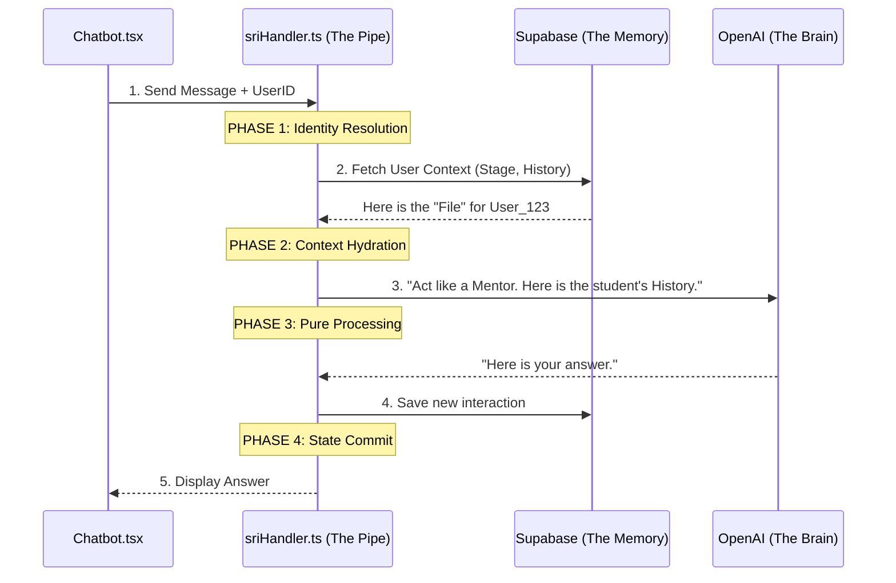

# How SRI works in your Chatbot

Think of SRI as a **"Single-Use Intelligent Pipe."** Here is the exact flow of how a message travels from your screen to the AI and back.

## 1. The Flow Diagram



---

## 2. Where the Code connects

### In [Chatbot.tsx](file:///c:/Abhi%20Drive/ottobon_Aca/src/components/Chatbot.tsx) (The Frontend)
When you click "Send," the chatbot doesn't try to think. It just packages your ID and message and hands it to the SRI handler.

```tsx
// src/components/Chatbot.tsx

const handleSend = async () => {
    const sriRequest = {
        userId: "user_123",  // Who is talking?
        mentorId: "alpha",   // Who are they talking to?
        message: input       // What did they say?
    };

    // Step 1: Hand it to the SRI Pipe
    const chatResult = await handleSriRequest(sriRequest); 
    
    // Step 5: Show the result
    setMessages(prev => [...prev, chatResult.answer]);
};
```

### In [sriHandler.ts](file:///c:/Abhi%20Drive/ottobon_Aca/src/services/sriHandler.ts) (The Backend Logic)
This is where the "Stateless" magic happens. The handler itself has **no memory**. It's like a clean slate for every request.

1.  **Identity:** It looks at `userId`.
2.  **Hydrate:** It fetches "Stage 1" or "Stage 2" from the DB.
3.  **Process:** It tells the AI: "The user is in Stage 1, so give them a guided answer."
4.  **Commit:** It saves the chat and then **forgets everything**.

---

## 3. Why is this better for your Chatbot?

-   **No "Brain Fog":** Normal chatbots get "confused" if a conversation gets too long because their memory gets cluttered. SRI ensures every single message starts with a perfectly clean, focused context.
-   **Security:** If Student A's message is being processed, the SRI "Pipe" is physically isolated from Student B's data.
-   **Training Wheels:** Because we "Hydrate" the context every time, we can check if a student just passed a quiz and instantly upgrade their chatbot from "Guided" (Stage 1) to "Independent" (Stage 3) mid-conversation!
